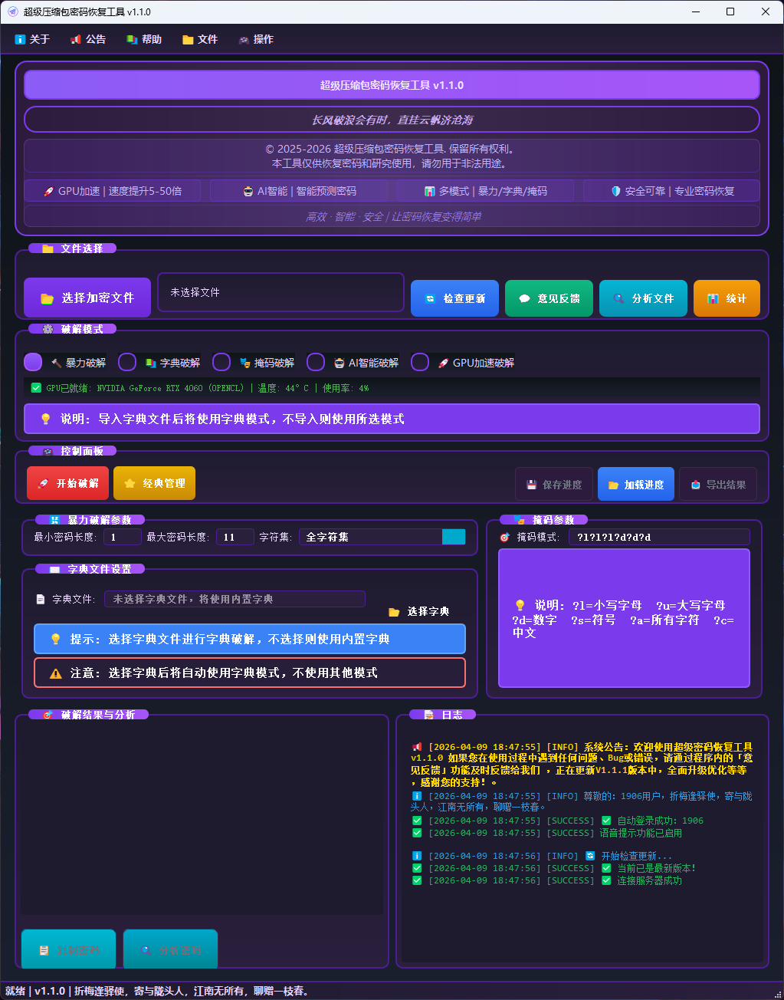

# 超级密码破解工具 v1.0.4

<div align="center">



**一款功能强大的压缩包密码破解工具**

[](LICENSE)
[](https://github.com/xuanxuan205/password-cracker)
[](https://python.org)
[](https://github.com/xuanxuan205/)

</div>

## 📋 项目简介

超级密码破解工具是一款专业的压缩包密码破解软件，支持多种破解模式和算法。本工具集成了 Hashcat 和 John the Ripper 两大知名密码破解引擎，提供了直观的图形界面和强大的破解功能。

**作者**: DeZai  
**QQ**: 208034175  
**版权**: © 2025 超级密码破解工具，保留所有权利  
**声明**: 本工具仅供学习和研究使用，请勿用于非法用途

## ✨ 主要特性

### 🔧 破解模式
- **暴力破解**: 支持自定义字符集的暴力破解
- **字典破解**: 使用内置或自定义字典进行破解
- **混合破解**: 结合多种破解策略提高成功率

### 📁 支持格式
- ZIP 压缩包
- RAR 压缩包
- 7Z 压缩包
- 其他常见压缩格式

### 🎯 核心功能
- **多线程破解**: 充分利用系统资源，提高破解效率
- **进度监控**: 实时显示破解进度和状态
- **结果保存**: 自动保存破解结果和日志
- **字典管理**: 内置多种字典，支持自定义字典
- **参数配置**: 灵活的破解参数设置

## 🖥️ 界面预览

### 主界面


### 功能特色
- 🎨 **现代化界面**: 简洁美观的用户界面设计
- 🔄 **实时反馈**: 破解过程实时状态显示
- 📊 **详细统计**: 破解进度和性能统计
- 🛠️ **参数调节**: 灵活的破解参数配置

## 🚀 快速开始

### 环境要求
- Windows 10/11 (64位)
- Python 3.7+
- 至少 4GB 内存
- 建议使用 SSD 硬盘

### 安装步骤

1. **克隆项目**
```bash
git clone https://github.com/xuanxuan205/password-cracker.git
cd password-cracker
```

2. **安装依赖**
```bash
pip install -r requirements.txt
```

3. **运行程序**
```bash
python main.py
```

## 📖 使用指南

### 基本使用流程

1. **选择压缩文件**
   - 点击"选择压缩文件"按钮
   - 选择需要破解的压缩包

2. **配置破解参数**
   - 选择破解模式（暴力破解/字典破解/混合破解）
   - 设置密码长度范围
   - 选择字符集或字典文件

3. **开始破解**
   - 点击"开始破解"按钮
   - 监控破解进度
   - 等待破解完成

4. **查看结果**
   - 破解成功后会显示密码
   - 结果自动保存到 `crack_results` 目录

### 高级功能

#### 自定义字典
```
1. 将字典文件放入 dictionaries 目录
2. 在界面中选择"字典破解"模式
3. 点击"选择字典"选择对应文件
```

#### 暴力破解设置
```
1. 选择"暴力破解"模式
2. 设置最小/最大密码长度
3. 选择字符集类型（数字/字母/符号等）
4. 配置破解模式参数
```

## 📁 项目结构

```
破解压缩包密码源码v1.0.4/
├── bin/                    # 第三方破解工具
│   ├── hashcat-6.2.6/     # Hashcat 破解引擎
│   └── john-1.9.0/        # John the Ripper
├── cracker/               # 核心破解模块
├── crack_results/         # 破解结果存储
├── dictionaries/          # 字典文件目录
├── images/               # 界面截图和图标
├── logs/                 # 日志文件
├── utils/                # 工具函数
├── main.py              # 主程序入口
└── README.md            # 项目说明文档
```

## 🔧 技术架构

### 核心技术栈
- **GUI框架**: PyQt5/Tkinter
- **破解引擎**: Hashcat + John the Ripper
- **多线程**: Python Threading
- **文件处理**: zipfile, rarfile, py7zr

### 破解算法
- **暴力破解**: 基于字符集的穷举算法
- **字典攻击**: 高效的字典匹配算法
- **混合模式**: 智能组合多种破解策略

## 📊 性能优化

- ⚡ **多核并行**: 充分利用多核CPU性能
- 🚀 **内存优化**: 智能内存管理，避免内存溢出
- 💾 **缓存机制**: 智能缓存常用数据
- 🎯 **算法优化**: 优化的破解算法，提高成功率

## ⚠️ 免责声明

本工具仅供学习和研究使用，使用者应当：

- ✅ 仅用于合法的密码恢复场景
- ✅ 获得文件所有者的明确授权
- ❌ 不得用于非法破解他人文件
- ❌ 不得用于任何违法犯罪活动

使用本工具产生的任何法律后果由使用者自行承担。

## 🤝 贡献指南

欢迎提交 Issue 和 Pull Request！

1. Fork 本项目
2. 创建特性分支 (`git checkout -b feature/AmazingFeature`)
3. 提交更改 (`git commit -m 'Add some AmazingFeature'`)
4. 推送到分支 (`git push origin feature/AmazingFeature`)
5. 开启 Pull Request

## 📞 联系方式

- **作者**: DeZai
- **QQ**: 208034175
- **邮箱**: [联系QQ获取]
- **项目地址**: [https://github.com/xuanxuan205/password-cracker]

## 💰 支持作者

如果这个项目对你有帮助，可以请作者喝杯咖啡：

<div align="center">

| 微信支付 | 支付宝 |
|---------|--------|
|  |  |

</div>

## 📄 许可证

本项目采用 MIT 许可证 - 查看 [LICENSE](LICENSE) 文件了解详情。

---

<div align="center">

**如果这个项目对你有帮助，请给它一个 ⭐**

Made with ❤️ by DeZai

</div>