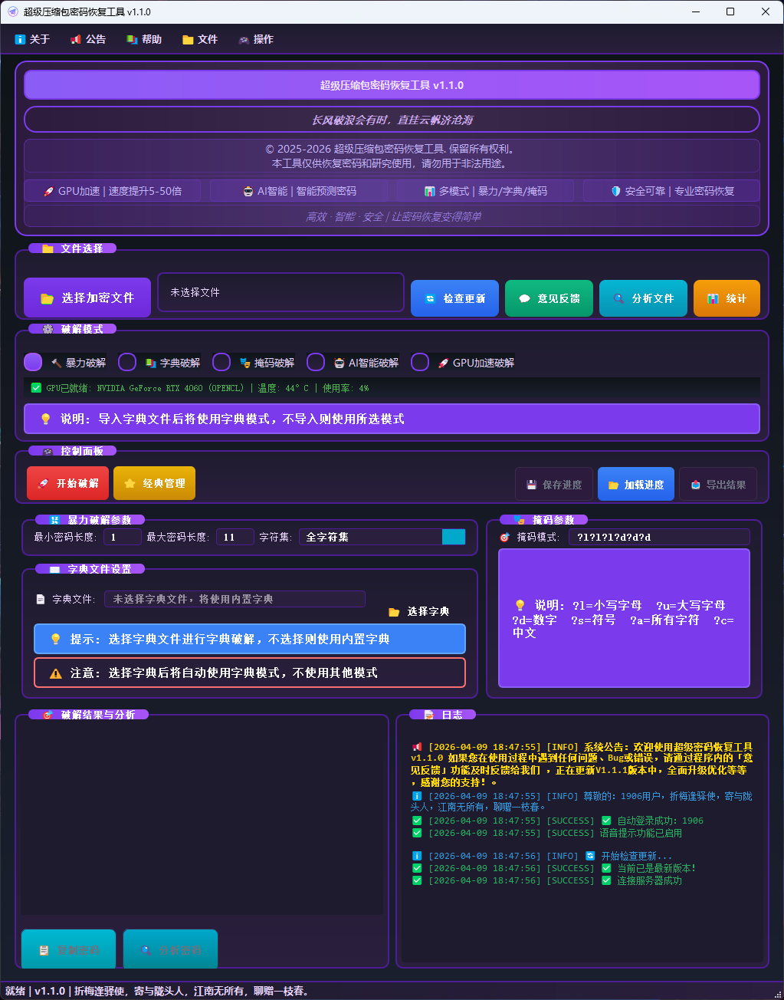

# 🔐 压缩包密码恢复工具

**GPU 加速 | AI 辅助 | Windows 平台**

*专注于本人或已授权文件的密码恢复、状态监控与本地工具调用，适合 Windows 用户日常使用与排障。*

[🚀 立即下载](#-下载安装) • [📖 使用说明](#-使用说明) • [🧭 功能概览](#-功能概览) • [⚙️ 系统要求](#-系统要求) • [🛡 合规使用声明](#-合规使用声明) • [💬 问题反馈](#-问题反馈)

---

## 📚 目录

- [下载安装](#-下载安装)
- [使用说明](#-使用说明)
- [功能概览](#-功能概览)
- [系统要求](#-系统要求)
- [GPU 与性能说明](#-gpu-与性能说明)
- [合规使用声明](#-合规使用声明)
- [问题反馈](#-问题反馈)
- [许可证](#-许可证)

---

## 🚀 下载安装

### 💡 下载建议
- 新手用户：推荐使用安装包版本，一键安装，开箱即用
- 高级用户：可使用便携版或源码构建版本

如需其他版本，请访问 [Releases 页面](https://github.com/xuanxuan205/Crackingthecompressedpackagepasswordtool/releases) 手动下载。

---

## 📖 使用说明

### 基本操作
1. 打开程序并选择需要恢复的压缩包文件
2. 根据已知信息选择合适的模式
3. 设置密码长度、字符集或字典等参数
4. 点击开始并观察进度与结果

### 使用建议
- 优先尝试你最有把握的密码规律
- 尽量缩小密码长度范围，提高恢复效率
- 如遇到性能问题，可优先检查 GPU 驱动和系统资源占用

---

## 🧭 功能概览

- 支持 ZIP / RAR / 7Z 等常见压缩文件
- 支持字典、掩码、AI 辅助、混合、GPU 加速等模式
- 支持进度保存与继续恢复
- 支持 GPU 状态诊断与排障提示
- 支持更新检查、公告查看与在线教程入口
- 支持 QQ / 163 邮箱绑定与找回密码功能

---

## ⚙️ 系统要求

- Windows 10 / 11（64 位）
- 建议内存 4GB 及以上
- 建议预留 2GB 以上可用磁盘空间
- 如需 GPU 加速，建议使用支持 OpenCL 的 NVIDIA / AMD 显卡

---

## 🧪 GPU 与性能说明

- 程序支持检测 GPU 并显示运行状态
- 若出现兼容提示，通常仍可通过 OpenCL 方式使用
- 可导出 GPU 诊断信息，便于排查驱动、温度与利用率问题
- 不同压缩格式的校验开销不同，速度表现会有差异

---

## 🛡 合规使用声明

本工具仅用于恢复本人文件或已获得明确授权的文件密码。

请勿将本工具用于任何未授权访问、非法入侵或其他违反法律法规的用途。使用者应自行承担因违规使用所产生的后果。

---

## 💬 问题反馈

- 使用程序内“意见反馈”提交问题
- 建议附带：程序版本、文件类型、是否启用 GPU、GPU 诊断文件
- 重要问题也可通过仓库 Issue 反馈

---

## 📄 许可证

本项目采用自定义使用协议，详情请查看 [使用协议](使用协议.md)。

**🌟 感谢使用压缩包密码恢复工具🌟**

*如果对您有帮助，请给个 ⭐ 支持一下！*

