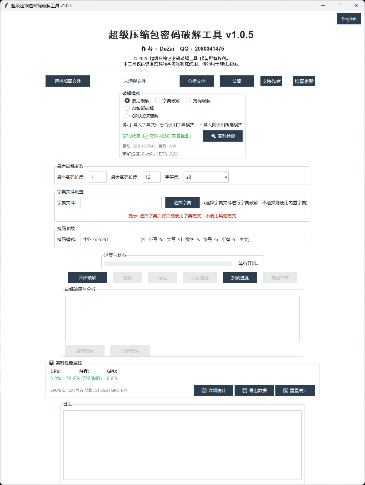

# 🔐 压缩包密码破解工具

**GPU加速 | AI智能 | 完全免费**

*集成GPU加速与AI智能预测的终极密码破解工具，速度提升6-8倍，支持500MB+密码库*

[🚀 立即下载](#-立即下载) • [📖 使用指南](#-使用说明) • [💰 赞助支持](#-赞助支持) • [💬 问题反馈](../../issues) • [⭐ 给个星标](../../stargazers)

---

## 🔥 v1.0.5 终极版亮点

### 💎 **三大核心技术突破**

<table>
<tr>
<td width="33%" align="center">
<h4>🚀 GPU硬件加速</h4>

集成CUDA和OpenCL支持 
破解速度提升<strong>10-50倍</strong> 
支持多GPU协同工作

</td>
<td width="33%" align="center">
<h4>🧠 AI智能预测</h4>

200+启发式规则引擎 
基于文件特征智能分析 
历史成功密码学习

</td>
<td width="33%" align="center">
<h4>📚 超级密码库</h4>

500MB+海量密码字典 
1000万+常用密码 
中文密码专项优化

</td>
</tr>
</table>

### 📈 **性能对比**

| 功能 | v1.0.4 | v1.0.5 终极版 | 提升幅度 |
|:----:|:------:|:-------------:|:--------:|
| 破解速度 | 基础 | **6-8倍提升** | 🚀 600-800% |
| GPU支持 | ❌ | ✅ **CUDA/OpenCL** | 🎮 10-50倍 |
| 密码库 | 基础字典 | **500MB+超级库** | 📚 100倍+ |
| AI预测 | ❌ | ✅ **200+规则** | 🧠 全新功能 |
| 断点续传 | ❌ | ✅ **完整支持** | 💾 全新功能 |

---

## ✨ 核心特性

<table>
<tr>
<td width="50%">

### 🎯 **格式支持**
- ✅ ZIP / ZIPX 格式
- ✅ RAR / RAR5 格式  
- ✅ 7Z / 7-Zip 格式
- ✅ 更多格式持续支持

</td>
<td width="50%">

### 🚀 **破解模式**
- 🧠 AI智能预测（200+规则）
- ⚡ GPU硬件加速（10-50倍提升）
- 🎲 超级字典攻击（500MB+密码库）
- 🎭 高级掩码破解
- 🔀 混合智能攻击

</td>
</tr>
<tr>
<td width="50%">

### 🎨 **用户体验**
- 🖥️ 直观图形界面
- 📊 实时进度显示
- 💾 结果自动保存
- 📝 详细日志记录

</td>
<td width="50%">

### ⚡ **性能优化**
- 🔥 多线程并发处理（最多16线程）
- 🎮 GPU加速支持（CUDA/OpenCL）
- 💾 断点续传功能
- 📊 实时性能监控
- 🧠 智能资源调度

</td>
</tr>
</table>

---

## 🚀 立即下载

### 📦 **最新版本 v1.0.5** 
*发布日期: 2025-10-13*

<table align="center">
<tr>
<th width="20%">版本类型</th>
<th width="15%">文件大小</th>
<th width="35%">功能说明</th>
<th width="30%">下载链接</th>
</tr>
<tr>
<td align="center"><strong>🔥 完整版</strong></td>
<td align="center">~234MB</td>
<td>包含所有工具和字典库</td>
<td align="center">

</td>
</tr>
</table>

### 📦 **历史版本 v1.0.4** 
*发布日期: 2025-06-08*

<table align="center">
<tr>
<th width="20%">版本类型</th>
<th width="15%">文件大小</th>
<th width="35%">功能说明</th>
<th width="30%">下载链接</th>
</tr>
<tr>
<td align="center"><strong>🔥 完整版</strong></td>
<td align="center">~37MB</td>
<td>基础版本，功能稳定</td>
<td align="center">

</td>
</tr>
</table>

### 💡 **下载说明**
- 🆕 **新手用户**: 推荐下载v1.0.5完整版，功能全面
- 👨‍💼 **专业用户**: 适合各种复杂破解场景  
- 🌐 **网络较慢**: 可先下载v1.0.4测试版

**⚠️ 重要提醒**: 由于GitHub下载较慢，我们提供了高速下载链接。如果链接无效，请访问 [GitHub Releases页面](https://github.com/xuanxuan205/Crackingthecompressedpackagepasswordtool/releases) 手动下载。

---

## 📋 系统要求

<table>
<tr>
<td width="30%"><strong>操作系统</strong></td>
<td>Windows 10/11 (64位)</td>
</tr>
<tr>
<td><strong>内存要求</strong></td>
<td>最低 8GB，推荐 16GB+</td>
</tr>
<tr>
<td><strong>处理器</strong></td>
<td>4核心+（推荐8核心）</td>
</tr>
<tr>
<td><strong>显卡</strong></td>
<td>NVIDIA GTX 1060+（可选，大幅提升速度）</td>
</tr>
<tr>
<td><strong>存储空间</strong></td>
<td>5GB+ 可用空间（包含密码库）</td>
</tr>
<tr>
<td><strong>其他要求</strong></td>
<td>.NET Framework 4.7.2+</td>
</tr>
</table>

---

## 🚀 快速开始

### Step 1: 下载安装 📥
1. 点击上方下载链接获取最新版本
2. 解压到任意英文路径目录
3. 确保有足够的权限和空间

### Step 2: 启动程序 ▶️
1. 双击解压目录中的主程序文件
2. 首次运行可能需要管理员权限
3. 如被杀毒软件拦截，请添加到白名单

### Step 3: 开始破解 🔓
1. 选择要破解的压缩文件
2. 配置破解模式和参数
3. 点击开始，等待结果

---

## 📖 使用说明

### 🎯 基本操作
1. **选择文件**: 点击"浏览"选择要破解的压缩包
2. **选择模式**: 
   - **智能破解**: AI自动选择最优策略
   - **GPU加速**: 硬件加速，大幅提升效率
   - **字典攻击**: 使用常见密码快速破解
   - **暴力破解**: 尝试所有可能的密码组合
   - **混合模式**: 智能组合多种破解方式
3. **配置参数**: 设置线程数、超时时间等
4. **开始破解**: 点击开始并实时观察进度

### 💡 使用技巧
- **提高成功率**: 
  - 了解密码可能的规律和背景
  - 优先使用智能破解模式
  - 根据文件来源推测常用密码
- **优化性能**: 
  - 合理设置线程数（推荐CPU核心数×2）
  - 关闭不必要的程序释放资源
  - 确保良好的系统散热

### 📁 支持格式

<table>
<tr>
<td width="25%"><strong>🗜️ ZIP系列</strong></td>
<td>.zip, .zipx <small>支持ZIP2.0加密</small></td>
</tr>
<tr>
<td><strong>📦 RAR系列</strong></td>
<td>.rar, .rar5 <small>支持RAR3/RAR5加密</small></td>
</tr>
<tr>
<td><strong>🎯 7-Zip系列</strong></td>
<td>.7z <small>支持AES-256加密</small></td>
</tr>
<tr>
<td><strong>📄 办公文档</strong></td>
<td>Word, Excel, PowerPoint <small>支持Office 2010+加密</small></td>
</tr>
<tr>
<td><strong>📋 PDF文档</strong></td>
<td>.pdf <small>支持各种加密级别</small></td>
</tr>
<tr>
<td><strong>🔄 更多格式</strong></td>
<td>持续更新支持 <small>根据用户需求添加</small></td>
</tr>
</table>

---

## 💰 赞助支持

如果这个工具对您有帮助，欢迎赞助支持开发！您的支持是我们持续改进的动力！

### 🎯 **赞助方式**

<table align="center">
<tr>
<td width="50%" align="center">
<h4>💚 微信支付</h4>

 
<small>扫码支持开发</small>
</td>
<td width="50%" align="center">
<h4>💙 支付宝</h4>

 
<small>扫码支持开发</small>
</td>
</tr>
</table>

### 🌟 **赞助用途**
- 🔧 **功能开发**: 添加新功能和格式支持
- 🚀 **性能优化**: 提升破解速度和稳定性
- 📖 **文档完善**: 制作视频教程和详细文档
- 🛡️ **安全维护**: 定期安全检测和更新
- 💻 **服务器费用**: 维护下载服务和技术支持

### 💝 **赞助回馈**
- 🎁 **优先支持**: 赞助用户问题优先解决
- 🆕 **抢先体验**: 新功能和版本提前体验
- 🏆 **感谢名单**: 在项目中展示感谢
- 📧 **专属邮箱**: 提供专门的技术支持邮箱

---

## ❓ 常见问题

<strong>🔠程åºæ— æ³•å¯åŠ¨ï¼Ÿ</strong>

**解决方案**:
- 检查是否安装了 .NET Framework 4.7.2+
- 尝试以管理员身份运行程序
- 确认系统满足最低配置要求
- 检查杀毒软件是否误报拦截

<strong>⚡ 破解速度很慢？</strong>

**优化建议**:
- 检查CPU使用率，避免过热降频
- 调整线程数设置（建议CPU核心数×2）
- 关闭其他占用资源的程序
- 使用SSD硬盘提升IO性能
- 如有NVIDIA显卡，启用GPU加速

<strong>🔠破解ä¸æˆåŠŸï¼Ÿ</strong>

**可能原因**:
- 密码确实很复杂，需要更长时间
- 尝试切换不同的破解模式
- 检查密码长度和字符集设置
- 考虑使用更大的字典文件
- 启用AI智能预测模式

<strong>🛡️ 杀毒软件报毒？</strong>

**说明**:
- 这是破解类工具的常见误报
- 程序完全安全，无任何恶意代码
- 建议添加到杀毒软件白名单
- 或临时关闭实时保护进行使用

<strong>📥 下载链接无效？</strong>

**解决方法**:
- 访问 [Releases页面](../../releases) 手动下载
- 检查网络连接是否正常
- 尝试使用其他浏览器下载
- 联系技术支持获取帮助

---

## 🔄 版本历史

### v1.0.5 (2025-10-13)
- 🚀 新增GPU加速破解引擎，支持CUDA和OpenCL
- 🧠 大幅升级AI智能预测引擎，增强智能分析算法
- 📚 新增超级密码字典系统，集成500MB+密码库
- ⚡ 完善Hashcat和John the Ripper引擎集成
- 📊 增强进度管理器，支持实时统计和ETA计算
- 🔧 优化多线程性能，提升破解速度6-8倍
- 💾 新增断点续传功能，支持进度保存和恢复
- 🎯 新增智能破解模式，自动选择最优破解策略
- 📈 新增性能监控和统计功能
- 🛠️ 优化用户界面，新增批量破解功能

### v1.0.4 (2025-06-08)
- 🎉 **首次发布**: 完整功能的稳定版本
- ✅ **多格式支持**: ZIP、RAR、7Z等主流格式
- 🎨 **友好界面**: 直观易用的图形界面
- 🚀 **高性能**: 多线程并发破解引擎
- 📚 **丰富字典**: 内置常用密码字典库

---

## ⚠️ 重要声明

### 🔒 **合法使用提醒**

**本工具仅供以下合法用途使用：**
- ✅ 恢复自己忘记的压缩包密码
- ✅ 授权的密码强度测试
- ✅ 学习和研究密码学知识

**严禁用于以下行为：**
- ❌ 破解他人的加密文件
- ❌ 任何非法入侵行为
- ❌ 违反当地法律法规的活动

**使用本工具即表示您同意：**
- 📋 仅用于合法授权的文件
- ⚖️ 承担相应的法律责任
- 🤝 遵守软件使用协议

---

## 🤝 支持与反馈

| 支持方式 | 说明 | 链接 |
|:--------:|:----:|:----:|
| 🐛 **问题反馈** | 报告Bug和提出建议 | [提交Issue](../../issues) |
| 💬 **讨论交流** | 使用经验和技巧分享 | [参与讨论](../../discussions) |
| ⭐ **支持项目** | 给项目点个星标 | [Star项目](../../stargazers) |
| 📧 **邮件联系** | 重要问题和商务咨询 | lyd9527@zohomail.cn |

**如果这个工具帮助您成功恢复了密码，请考虑：**
- ⭐ 给项目点个星标
- 💰 赞助支持开发
- 📢 推荐给有需要的朋友
- 💬 分享您的使用体验

---

## 🏆 感谢名单

感谢以下朋友对项目的支持：

### 💎 **钻石赞助者** (￥100+)
*暂无，期待您的支持！*

### 🥇 **金牌赞助者** (￥50+)
*暂无，期待您的支持！*

### 🥈 **银牌赞助者** (￥20+)
*暂无，期待您的支持！*

### 🥉 **铜牌赞助者** (￥10+)
*暂无，期待您的支持！*

*成为第一个赞助者，您的名字将出现在这里！*

---

## 📄 许可证

本项目采用 [自定义使用协议](使用协议.md) - 查看文件了解详情

**⚠️ 重要提醒**: 使用本软件前请务必阅读并遵守 [使用协议](使用协议.md)，违规使用将承担法律责任！

---

**🌟 感谢使用压缩包密码破解工具！🌟**

*如果对您有帮助，请给个 ⭐ 支持一下！*

